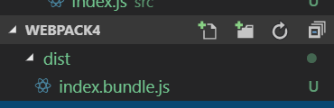

# webpack教程

## 基本配置

1. 如何安装webpack呢
* 使用 npm 命令，你的当前文件中会多出 **node_modules** 文件夹和 **package-lock.json** 的文件
> npm install --save-dev webpack

2. 新建一个文件夹和一个文件
* webpack4会默认找这个文件夹中的文件作为入口文件
>创建一个 **src** 目录，然后在目录下创建一个 **index.js** 的文件

3. 新建一个webpack的配置文件
* 创建一个新的配置文件
> 在当前目录下创建一个 **webpack.config.js** 的文件

4. 配置webpack.config.js
* 我们可以以下的代码进行的一个简单的配置
> 将下面的代码复制到 **webpack.config.js** 文件中

```
var path = require('path');

module.exports = {
  mode: 'development',
  entry: './index.js',//入口文件
  output: {
    path: path.resolve(__dirname, 'dist'),
    filename: 'index.bundle.js'//打包发布的生成的文件
  }
};
```

## 开始使用webpack的命令

    在本目录下终端或者命令行使用以下命令
>   webpack 
    
    当我们输入完这个命令之后，你会发现你的当前目录下多出来了
    

